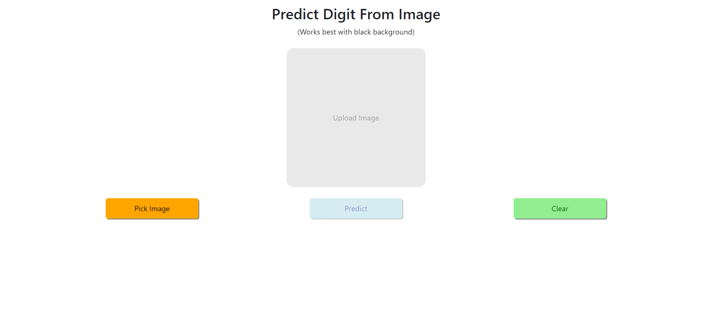
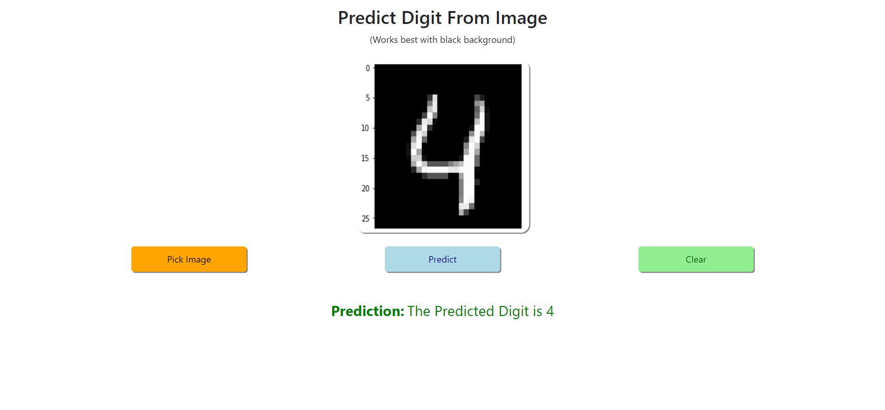

# Steps to run server and client sides:

- Open two terminals. 
- In 1st one - go into <b>`FlaskAPI`</b> folder and type <b>`pip install -r requirements.txt`</b> to get all the required python packages and then type <b>`python wsgi.py`</b> to start the server.
- In 2nd one - go into <b>`react-flask-app`</b> and type <b>`npm install`</b> to install all the required node_modules and then type <b>`npm start`</b> to start the client.

# Working of the model:
- Click on <b>`Pick Image`</b> and upload any image (Preferably, digit with black background - as the model is trained for such images).
- Press <b>`Predict`</b> and you will get the results just below.

# Preview:
<table>
  <tr>
    <td></td>
  </tr>
  <tr>
    <td></td>
  </tr>
</table>